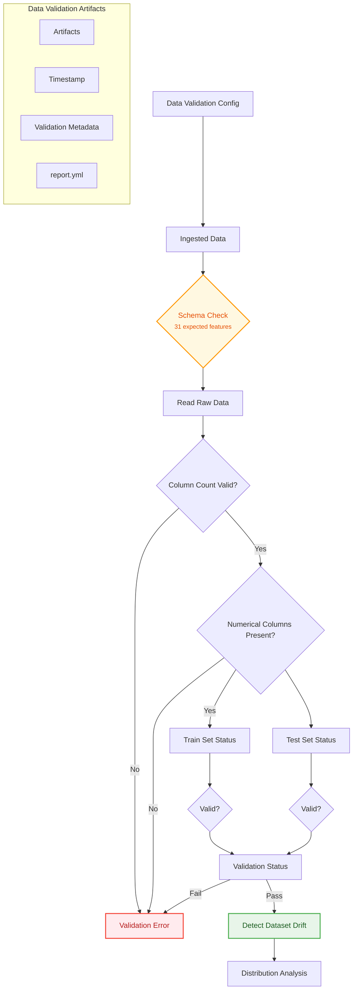

# 🛡️ Phishing URL Detection System
This project implements a phishing website detection system using machine learning, with a strong focus on robustness, reproducibility, and production-grade deployment. The system includes end-to-end pipelines for data ingestion, validation, model training, logging, prediction API, and automated cloud deployment.

## 🎯 1. Problem Statement
The goal is to classify URLs as legitimate or phishing based on a set of features derived from URL structure, domain metadata, and web security signals (e.g., SSL presence, domain age, redirects, etc.).
This addresses a critical cybersecurity challenge, as phishing remains one of the most common attack vectors for credential theft and system compromise. The target variable (Result) is binary:
- 0: Legitimate URL
- 1: Phishing URL

## 🧪 2. Data Pipeline
The system follows a structured ingest → validate → transform → train workflow:

### 🔽 Data Ingestion
Data is simulated from a **MongoDB database**, mimicking a real-world scenario of continuous URL monitoring.
Secure connection and tabular extraction ensure reliable data sourcing.
### 🧹 Data Transformation
Preprocessing: encoding of categorical variables (if applicable), feature scaling (for models like Logistic Regression).
Missing value imputation: KNNImputer is used to fill missing values while preserving multivariate feature relationships.

### ✅ Data Validation Workflow

 Before training, a rigorous validation pipeline ensures data quality and stability:

- Schema validation: checks column count and data types.
- Data drift detection: statistical tests from SciPy (Kolmogorov-Smirnov, Chi-square, etc.) compare training and test distributions.
-  Any validation failure halts the pipeline and generates a detailed report.yml.

## 🤖 3. Model Training
Multiple algorithms were trained and compared using hyperparameter tuning:

- Decision Tree
- Random Forest
- Gradient Boosting
- Logistic Regression
- AdaBoost
- XGBoostClassifier

**Grid Search** with **cross-validation** was used to optimize hyperparameters, maximizing the F1-score—a critical metric for imbalanced security-related classification tasks.

## 📊 4. Model Logging & Evaluation with MLflow
All experiments are tracked using **MLflow**, hosted on **DagsHub**:
- Model parameters
- Performance metrics (accuracy, precision, recall, F1, AUC)
- Artifacts (serialized model, validation report)
- Source code and environment (requirements.txt)

This enables full reproducibility, experiment comparison, and seamless model selection for production.

🔗 [View experiments on DagsHub](https://dagshub.com/garcialejan/Network-security-project.mlflow/#/experiments/0?searchFilter=&orderByKey=attributes.start_time&orderByAsc=false&startTime=ALL&lifecycleFilter=Active&modelVersionFilter=All+Runs&datasetsFilter=W10%3D)

## 🚀 5. Prediction & Retraining API
A REST API built with **FastAPI*** exposes two key endpoints:
- POST /predict: accepts URL features and returns a prediction (phishing / legitimate).
- POST /train: triggers a full retraining cycle with the latest data (enabling continuous learning).

The API includes input validation, structured logging, and error handling.

## 🐳 6. Containerization
The entire application (API + model) is containerized using Docker:

- Base image: python:3.10-slim
- Minimal dependency installation
- Model and code copying

This ensures environment consistency across development, testing, and production.

## ☁️ 7. CI/CD with GitHub Actions
An automated **CI/CD** pipeline in **GitHub Actions** triggers on every push to main:

- Runs data validation and unit tests
- Trains and evaluates models
- Uploads the best model to AWS S3
- Builds and pushes the Docker image to Amazon ECR
- Deploys the application to an EC2 instance (via remote bootstrap script)
This end-to-end automation ensures that only validated, high-quality versions reach production.